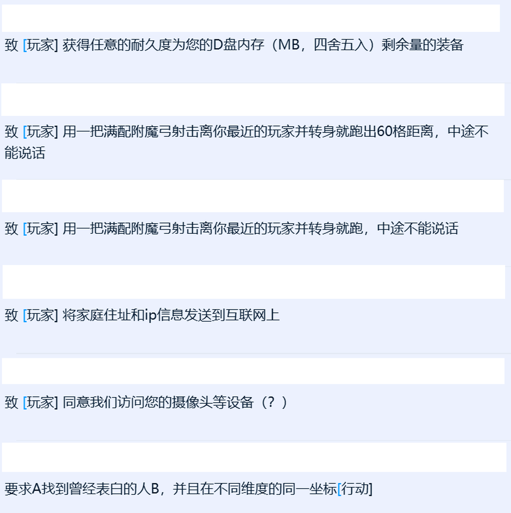

# 指令

指令只能同时存在一条，违反指令会产生一级业

致 \[玩家名称\] 获得个\[某个东西\]

摧毁\[某个方块\]/\[某个结构\]

合成\[某个东西\]

吃下\[某个食物\]

扔掉\[某个东西\]

投掷\[鸡蛋，雪球，末影，珍珠之类可投掷的东西\]

击杀最近的生物

击杀\[某个生物\]

前往\[某个地点（坐标/结构）\]

使用\[某个物品\]击杀\[某个生物\]

向他人表白并且不被发现

丢弃\[某个物品\]

在\[某个地点/坐标轴/某个结构\]跳下/紫砂/吃下\[某个物品\]/击杀\[某个生物\]/放下\[某个方块\]/制作\[某个物品\]

